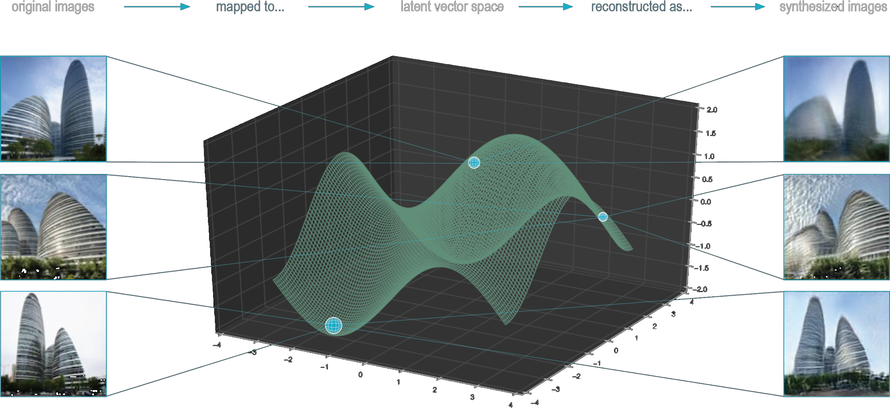
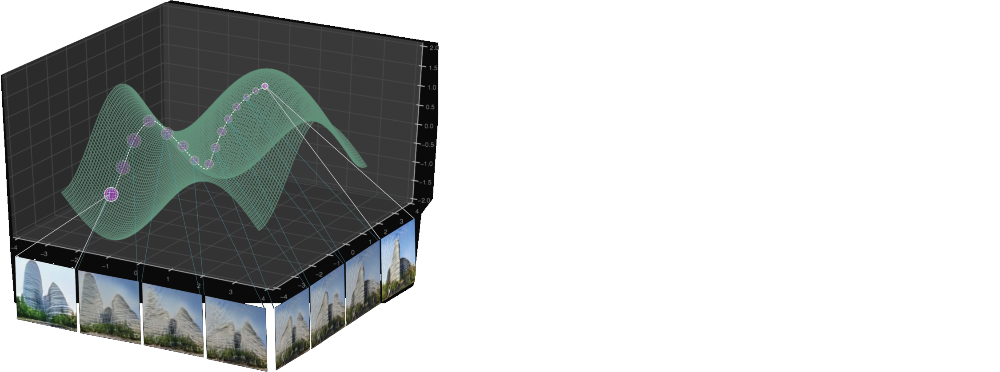

# Architectural Image Synthesis Control Methods

## About 

There are many examples of image synthesis applications being used to generate images of art, design objects, and architecture. However, the overwhelming majority of these projects do not provide accurate methods of controlling or modifying what is being created.  For instance, if you want to change only a persons hairstyle rather than their entire face within a generated portrait image.

This project aims to explore various methods to target and control various elements within generated images through direct interaction with latent vector space.  In particular, how images generated in the style of Zaha hadid buildings can be carefully modified by a designer.  Here, various models such as VanillaGAN, CycleGAN, and StyleGAN2 are used to explore different control techniques. For training and testing data, a small custom dataset of 220 images of zaha hadid designed office buildings was used.


## Project Page

An expanded description of this model implimentation can be found on its project page here:

[www.michaelhasey.com/controlling_gans](https://www.michaelhasey.com/controlling_gans)

## Table of Contents

- [Dataset](#Dataset)
- [Method-1](#Method-1)
- [Method-2](#Method-2)
- [Method-3](#Method-3)
- [Method-4](#Method-4)
- [References](#References)
- [Citation](#Citation)

<br>

## Uncontrolled vs. Controlled

The left animation below illustrates how GANS, when left uncontrolled, can generate a wide range of imagery in a seemingly random manner.  In this state, composition, geometry, environment, etc. are left to chance.  The image to the right illustrates how GANs can be controlled when properly engaging with latent space.  Here, the height of the left tower is being targeted and altered by carefully manipulating particular latent space vectors.


<br>

## Dataset

A custom 220 image dataset was used to train all models in this experiment.  The dataset includes images of the Wangjin Soho building in China designed by Zaha Hadid Architects.  This particular building was chosen for its strong geometric gestures, recognizable style, and strong online presence in regards to image volume. 

<br>


<br>

The images within the database were collected using [Archi_Base](https://github.com/michaelhasey/Archi_Base); an online tool I developed for the autonomous construction of large architectural image-based datasets.  In regards to its operation, Archi_Base first collects user-specified images from online public databases, sorts them with an image-classifier algorithm, and then labels them according to class.  This resulted in a large and sorted image database ready for DNN application.

A custom image augmentation tool was then used to apply various flipping, warping and environmental lighting changes to the images in order to increase the overall dataset size and improve training.


The training dataset of building images can be found here: 

```
data/
```

<br>

## Method 1

### Image-to-Image Translation using CycleGAN

At its core, CycleGAN provides a technique to translate one image into the general style of another.  For example, it can transform an image of a horse galloping in a field into an image of a zebra galloping in a field.  Though the background and pose of the horse remains the same, the horse itself has transformed into a zebra.  This translation method gives us a great deal of control over the synthesis of new images.  Not only can we create new content, but we can control its overall shape or pose, and background as well by matching it to a pre-existing image. 

<br>


<br>

Above are six pairs of images.  Within each pair, there is a pre-existing real "source" image on the left (of the Heydar Aliyev Center building), and the new, generated "target" image on the right created by the AI model (in the style of the Wangjin Soho Building).  The "source" image provides the compositional constraints that the generated "target" image must match.  For instance, if the "source" image shows a tall building form in the middle of the image, the AI model must also generate a "target" image of a tall building in the middle, though in the "style" of the training data, which in this case, includes 220 images of the Wangjin Soho building design by Zaha Hadid.  In this way we can directly control the final composition of the generated "target" image.

### Implementation

#### Command Line Arguments

```
<--use_cycle_consistency_loss>:   To incorporate cycle consistency loss which greatly improves results
<train_iters>:   The number of training iterations to run

<--X>:  Select the location of images for domain X 
<--Y>:  Select the location of images for domain Y

* see additional arguements in models/cycle_gan.py
```

#### Running the model
An example implementation of the model to generate new "target" images in the style of the training dataset that matches the composition of a "source" image.

```
$ cd CycleGAN
$ python cycle_gan.py --use_cycle_consistency_loss
```

<br>

## Method 2

### Manipulating Latent Space Vectors using DCGAN & StyleGAN 2

One of the key aspects of GAN control includes accessing and manipulating latent space vectors.  Latent space is simply a representation of compressed data where similar data points are grouped closer together and dissimilar data points are grouped further apart within a multi-dimensional mathematical space.  For images, data points describing the content of an image are mapped to this latent space, and thus, images with similar content (ex. images of skyscrapers) have data points that are grouped closer together due to their geometric and compositional similarity.  

In addition to converting images into data points, we can also reverse this process and use corresponding latent space data points to reconstruct original images.  The below diagram represents two steps.  First, pixel-based data points are extracted from an image and mapped into latent space.  Then, those data points are used to reconstruct an image that looks similar to the original.  It is this “reconstructed” image that is in fact a new “synthesized” image that is not the original, but is very similar. Beyond image reconstruction, we can also mix or blend data points together that may have originated from different images.  The result of this would be an image that cohesively blends a number of previously disparate features into a single image.

<br>



### Implementation

#### Command Line Arguments

DCGAN 
```
<num_epochs>:   integer specifying the number of times backpropogation loops through all of the training data
<data_aug>:  "basic" or "deluxe".  Basic does not augment data.  Deluxe augments all data \
to help increase synthesis quality.
<--data>:  Location of training data
* see additional arguements in models/vanilla_gan.py
```

StyleGAN 2
```
<num_epochs>:   integer specifying the number of times backpropogation loops through all of the training data
<data_aug>:  "basic" or "deluxe".  Basic does not augment data.  Deluxe augments all data \
to help increase synthesis quality.
<--data>:  Location of training data
* see additional arguements in models/vanilla_gan.py
```

#### Running the models

DCGAN
```
$ cd DCGAN
$ python vanilla_gan.py --num_epochs=100 --data_aug=basic/deluxe
```

StyleGAN 2
```
$ cd styleGAN_2
$ python generate.py #to use noise loop & feature extraction functions
```

<br>

## Method 3

### Latent Space Interpolation using StyleGAN

GANs encode images as a collection of vectors within a complex multi-dimensional latent vector space.  Though difficult to imagine, various points or areas within this latent space relate to particular features within images.  For example, the patterns that define the outline of a building are located in one area of latent space, while the rules that control window grids exist in another.  Beyond parts and pieces, similar images tend to cluster together in latent space, for example, images of tall skyscrapers in one area and images of 2 storey houses in another. 

<br>



StyleGAN not only allows us to locate an images position within latent space, but also allows traverse between 2 or more images and explore areas in between.   So for example, we might explore images of buildings that contain both elements of skyscraper and 2-storey residential buildings.  Such direct control over latent space positioning allows us to control how and what we synthesize in novel imagery.

<br>


### Implementation

#### Command Line Arguments

```
* see full list of arguements in models/main.py line 523
```

#### Running the model

```
$ cd StyleGAN
$ python main.py
```

<br>

## Method 4

### Feature Extraction for Fine Detail Manipulation using StyleGAN 2

In addition to image reconstruction and interpolation between images, latent space provides us with the means to control finer image details such as content shape, positioning, colour, texture, etc.  This is done by using StyleGAN2’s feature extraction abilities, which searches for and targets areas of latent space that control these finer image features.  When applied to the Wangjin Soho dataset, we can use this tool to control things like building height, width, angle, and texture through targeted latent space manipulation.

<br>


<br>

As shown in the left animation above, the StyleGAN2 feature extraction tool was able to pinpoint the latent vector space that controls the height of the left tower.  In the animation on the right, it pinpointed the latent vector that controls the height of the right tower.  By manipulating these two vectors, both the left and right tower heights can be altered independently.  In this way, specific parts of a generated image can be specifically targeted and modified without drastically effecting the rest of the image.

### Implementation

#### Command Line Arguments

```
<num_epochs>:   integer specifying the number of times backpropogation loops through all of the training data
<data_aug>:  "basic" or "deluxe".  Basic does not augment data.  Deluxe augments all data \
to help increase synthesis quality.
<--data>:  Location of training data
* see additional arguements in models/vanilla_gan.py
```

#### Running the model

```
$ cd styleGAN_2
$ python generate.py #to use noise loop & feature extraction functions
```

<br>

## References

This project was completed as part of my final project for Carnegie Melon University's Learning Based Image Synthesis course 16 726 taught by Jun-Yan Zhu in Spring of 2021.

## Citation

If you find this project useful in your research, please consider citing:

``` 
@misc{mhasey2021,
    title={Image Synthesis Control Methods},
    author={Michael Hasey},
    year={2021},
}
```
