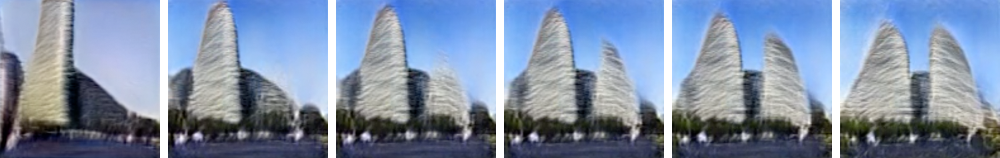
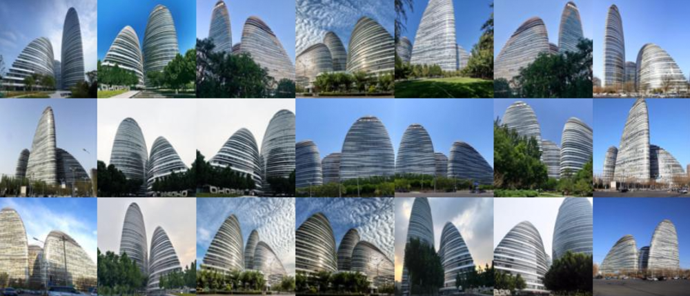
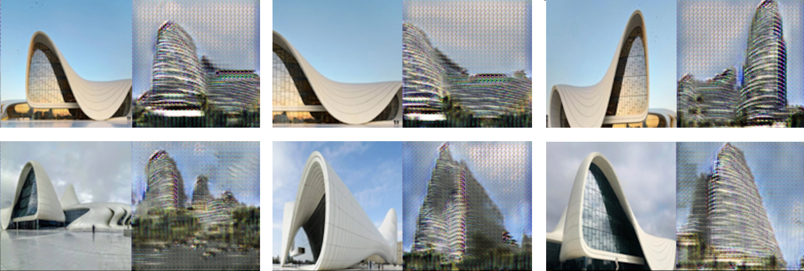

# Image Synthesis Control Methods

## About 

There are many examples of image synthesis applications being used to generate images of art, design objects, and architecture. However, the overwhelming majority of these projects do not provide accurate methods of controlling or modifying what is being created.  For instance, if you want to change only a persons hairstyle rather than their entire face within a generated portrait image.

This project aims to explore various methods to target and control various elements within generated images through direct interaction with latent vector space.  In particular, how images generated in the style of Zaha hadid buildings can be carefully modified by a designer.  Here, various models such as VanillaGAN, CycleGAN, and StyleGAN2 are used to explore different control techniques. For training and testing data, a small custom dataset of 220 images of zaha hadid designed office buildings was used.



## Project Page

An expanded description of this model implimentation can be found on its project page here:

```
www.michaelhasey.com/controlling_gans
```

## Uncontrolled vs. Controlled

The left animation below illustrates how GANS, when left uncontrolled, can generate a wide range of imagery in a seemingly random manner.  In this state, composition, geometry, environment, etc. are left to chance.  The image to the right illustrates how GANs can be controlled when properly engaging with latent space.  Here, the height of the left tower is being targeted and altered by carefully manipulating particular latent space vectors.


## Table of Contents

- [Dataset](#Dataset)
- [Approach](#Approach)
- [Implementation](#Implementation)
- [Performance](#Performance)
- [References](#References)
- [Citation](#Citation)

## Dataset

A custom 220 image dataset was used to train all models in this experiment.  The dataset includes images of the Wangjin Soho building in China designed by Zaha Hadid Architects.  This particular building was chosen for its strong geometric gestures, recognizable style, and strong online presence in regards to image volume. 

<br>



<br>

The images within the database were collected using Archi_Base; an online tool I developed for the autonomous construction of large architectural image-based datasets.  In regards to its operation, Archi_Base first collects user-specified images from online public databases, sorts them with an image-classifier algorithm, and then labels them according to class.  This resulted in a large and sorted image database ready for DNN application.

A custom image augmentation tool was then used to apply various flipping, warping and environmental lighting changes to the images in order to increase the overall dataset size and improve training.


The training dataset of building images can be found here: 

```
data/
```

## Method 1

### Image-to-Image Translation using CycleGAN

At its core, CycleGAN provides a technique to translate one image into the general style of another.  For example, it can transform an image of a horse galloping in a field into an image of a zebra galloping in a field.  Though the background and pose of the horse remains the same, the horse itself has transformed into a zebra.  This translation method gives us a great deal of control over the synthesis of new images.  Not only can we create new content, but we can control its overall shape or pose, and background as well by matching it to a pre-existing image. 



Above are six pairs of images.  Within each pair, there is a pre-existing real "source" image on the left (of the Heydar Aliyev Center building), and the new, generated "target" image on the right created by the AI model (in the style of the Wangjin Soho Building).  The "source" image provides the compositional constraints that the generated "target" image must match.  For instance, if the "source" image shows a tall building form in the middle of the image, the AI model must also generate a "target" image of a tall building in the middle, though in the "style" of the training data, which in this case, includes 220 images of the Wangjin Soho building design by Zaha Hadid.  In this way we can directly control the final composition of the generated "target" image.

### Implementation

#### Command Line Arguments

```
<--use_cycle_consistency_loss>:   To incorporate cycle consistency loss which \
greatly improves results
<num_epochs>:   integer specifying the number of times backpropogation loops through \
all of the training data
```

#### Below is an implimentation example to run CycleGAN to generate novel images in the style of the Wangjin Soho building but matching the pose of a given "pose" image

```
$ python cycle_gan.py --use_cycle_consistency_loss
```


## Performance

The below source and target image pairs were all blended using the above described Poisson Blending Technique.


## References

This project was completed as part of Carnegie Melon University's Learning Based Image Synthesis course 16 726 taught by Jun-Yan Zhu in Spring of 2021.

## Citation

If you find this project useful in your research, please consider citing:

``` 
@misc{mhasey2021,
    title={Image Blending Tool},
    author={Michael Hasey},
    year={2021},
}
```
